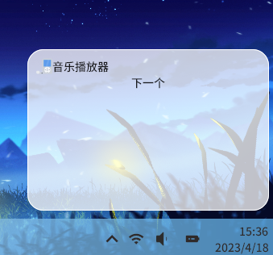
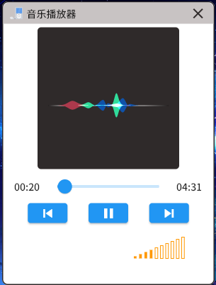
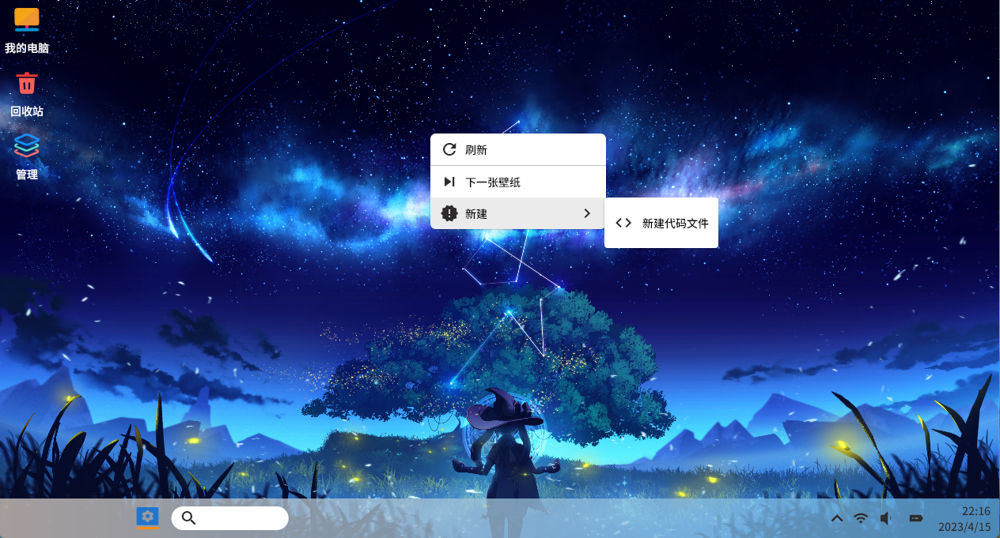
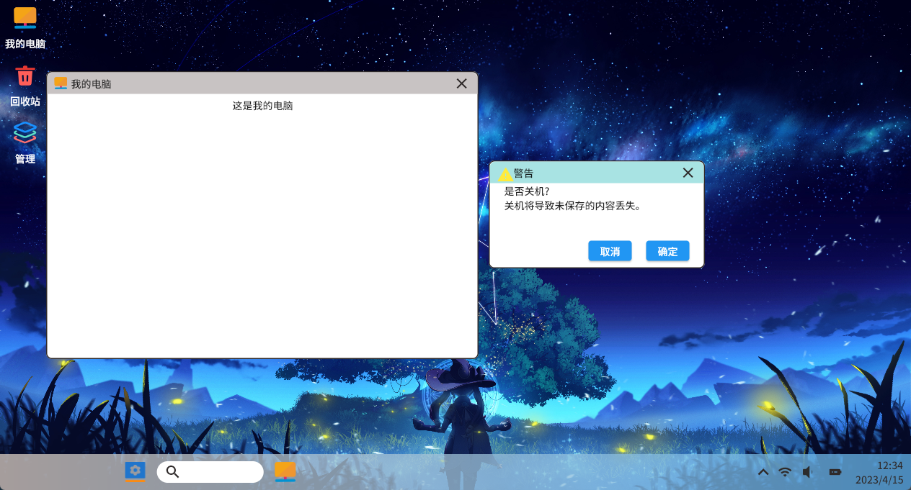
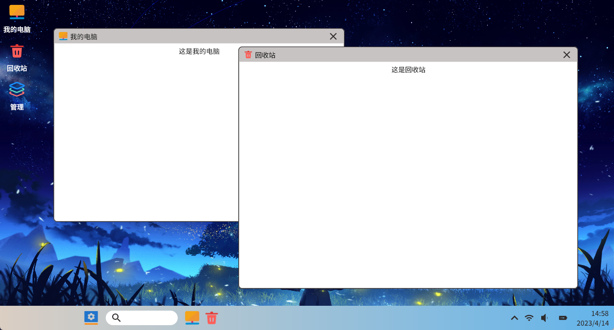
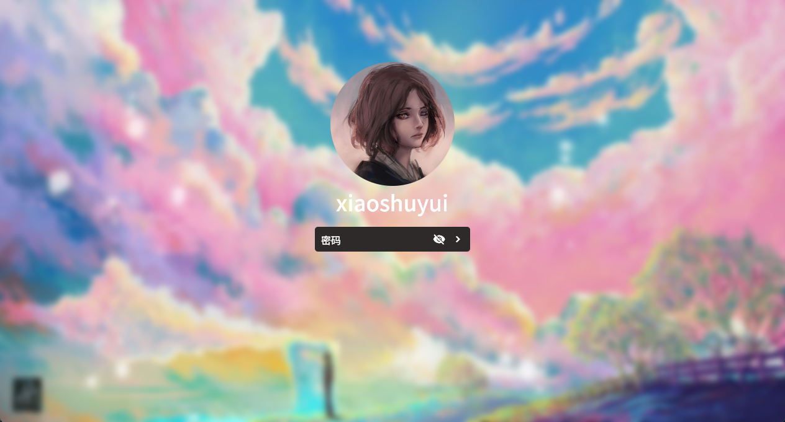

# flutter_desktop

## changelogs

* **0.1.5** add some features

  * 0.1.5+2 notifications  (WIP)

    
    
  * 0.1.5+1 custom volume controller (WIP)

    

* **0.1.4** 

  * **0.1.4+3** highlight taskbar app icons && context menu

    

  * **0.1.4+2** using `PageView`

  * **0.1.4+1** shutdown alert dialog

    

* **0.1.3** add logger (rust backend)

* **0.1.2** taskbar & status-bar

  

* **0.1.1** applications

  * **0.1.1+2** double click to start an application
  * **0.1.1+1** bump flutter_rust_bridge version
  * **0.1.1** application controller

## screenshots

